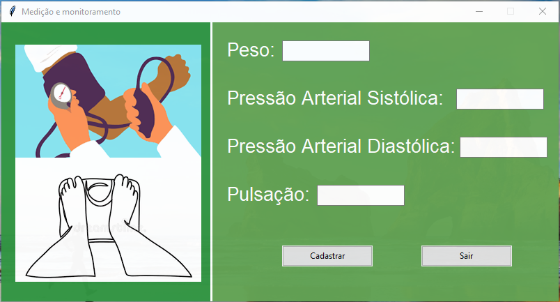
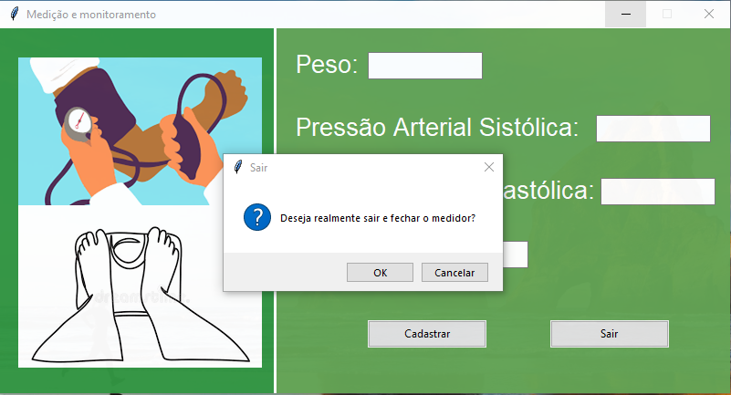

# medidor-pressao
Projeto monitoramento de peso e pressão arterial.

# :memo: Documentação do Projeto
Na documentação do projeto encontra-se a ideia do projeto, o processo de pesquisa, erros e soluções, conclusões, como também próximos passos a serem realizados.
* Para verificar a documentção basta [clicar aqui](https://github.com/rafhaelom/medidor-pressao/blob/main/medidor_peso_e_pressao_arterial.pdf) 

Para este projeto foi utilizado os seguintes materiais:
* Medidor digital de pressão arterial.
* Balança corporal digital.
* Linguagem de Programação Python.
* Banco de dados SQLite.

Tela Inicial do Projeto.

Ao pressionar o botão de cadastro após todos os dados preenchidos, aparece a mensagem:

Ao pressionar o botao de sair ou o de fechar a janela, aparece a mensagem:

