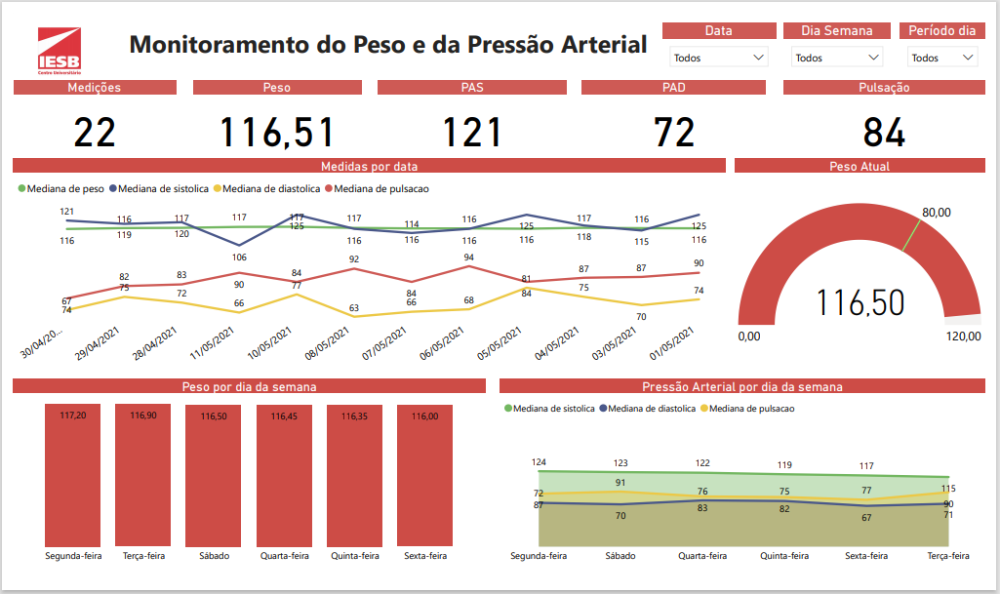
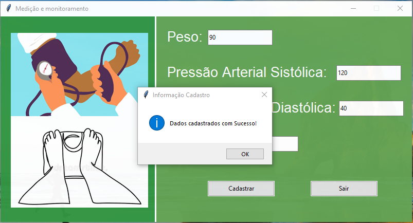

# Medição e Monitoramento do Peso e da Pressão Arterial
 

## Apresentação do projeto na Primeira JORNACIA-2021-IESB de Brasília - DF no Centro-Oeste.
A JornaCIA, 1ª Jornada de Ciência de Dados e Inteligência Artificial de Brasília, acontecerá nos dias 1, 2 e 3 de dezembro de 2021, das 17h às 22h. Abordará temas como:

- Oportunidades no mercado de trabalho para Ciência de Dados e Inteligência Artificial.
- Aplicações de Ciência de Dados e Inteligência Artificial nas esferas de governo e na iniciativa privada.
- Aplicações de Ciência de Dados e Inteligência Artificial em áreas específicas como na medicina, biologia, direito entre outras áreas.
- Ensino da Ciência de Dados e Inteligência Artificial nos cursos graduação e pós-graduação.
- Portifólios acadêmicos e profissionais.
- Minicursos para alunos do ensino fundamental, médio, graduação e pós-graduação.
- Workshops e cases de parceiros em Ciência de Dados e Inteligência Artificial.

* Reportagem sobre o projeto: https://www.iesb.br/noticias/alunos-do-iesb-apresentam-projetos-inovadores-na-1a-jornada-de-ciencia-de-dados-e-inteligencia-artificial-de-brasilia/

## :dart: Objetivo do projeto
Aplicativo desktop, onde é possível inserir seu peso, sua pressão arterial, e visualizar em um painel interativo o monitoramento diário, como também, imprimir suas medições para apresentação em consulta com o médico responsável do tratamento.

## :construction: Ajustes e melhorias

- [x] Construção da window.
- [x] Criação do Banco de Dados.
- [x] Criação do .exec no SO Windows.
- [ ] Coleta de dados.
- [X] Painel Interativo.
- [ ] Opção de impressão dos dados.

## :computer: Pré-requisitos
Antes de começar, será necessário os seguintes requisitos para execução deste projeto.

* Linguagem de Programação Python.
* Computador com Sistema Operacional Windows.
* Editor de códigos.
* Ler a documentação clicando [aqui](https://github.com/rafhaelom/medidor-pressao/blob/main/medidor_peso_e_pressao_arterial.pdf).

## :rocket: Instalação

## :bar_chart: Painel Interativo
A proposta do painel interativo é de ser possível ao usuário visualizar suas medições, e por meio deste ter um melhor controle dos níveis do peso e da pressão arterial. Abaixo tem-se o painel interativo:

# :memo: Documentação do Projeto
Na documentação do projeto encontra-se a ideia do projeto, o processo de pesquisa, erros e soluções, conclusões, como também próximos passos a serem realizados.
* Para verificar a documentção basta [clicar aqui](https://github.com/rafhaelom/medidor-pressao/blob/main/medidor_peso_e_pressao_arterial.pdf). 

## :pushpin: Materiais Utilizados
Para este projeto foi utilizado os seguintes materiais:
* Medidor digital de pressão arterial.
* Balança corporal digital.
* Linguagem de Programação Python.
* Banco de dados SQLite.

## Interação da window.

* Tela Inicial do Projeto.

* Ao pressionar o botão de cadastro após todos os dados preenchidos, aparece a mensagem:

* Ao pressionar o botao de sair ou o de fechar a janela, aparece a mensagem:

